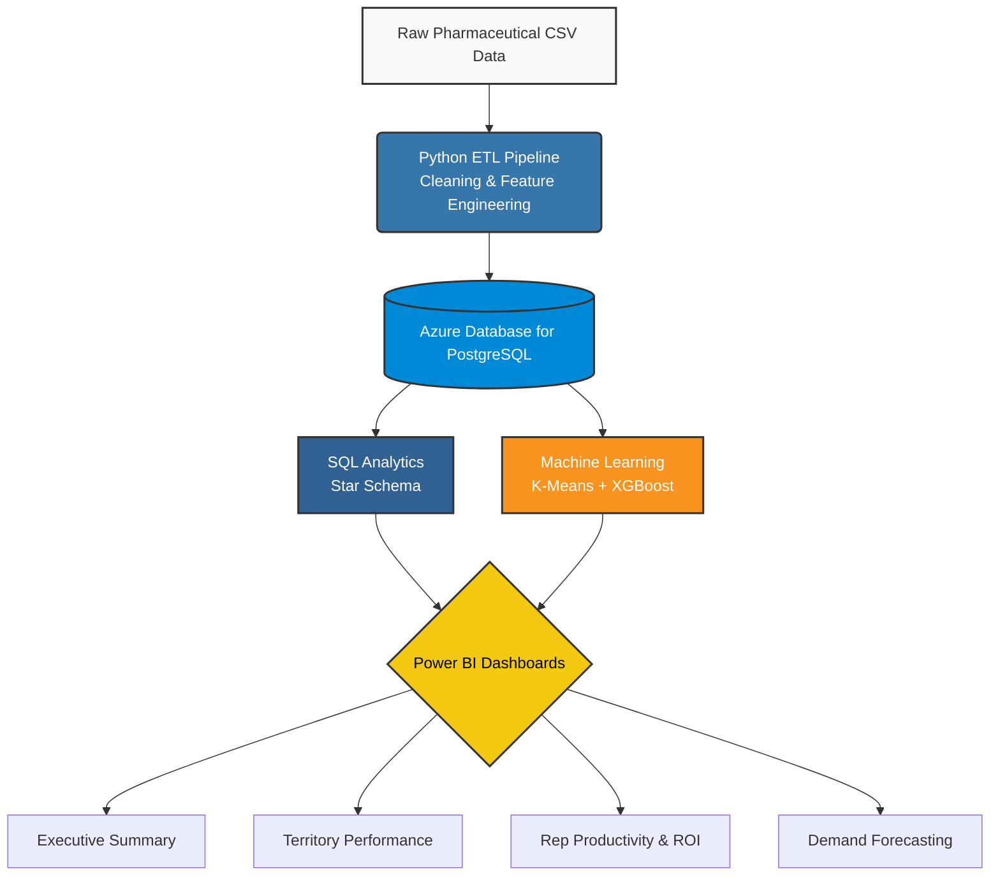
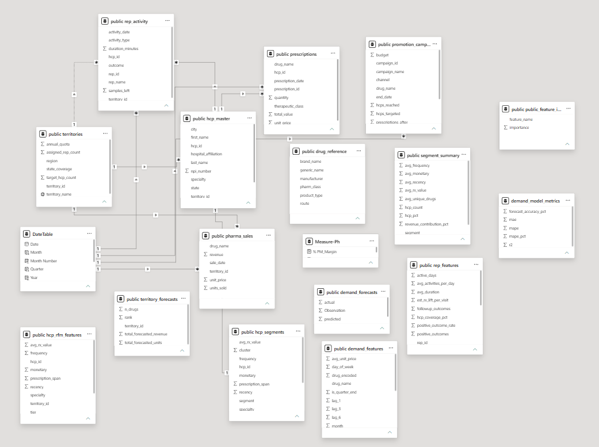
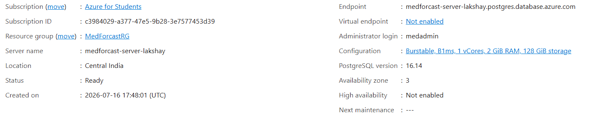
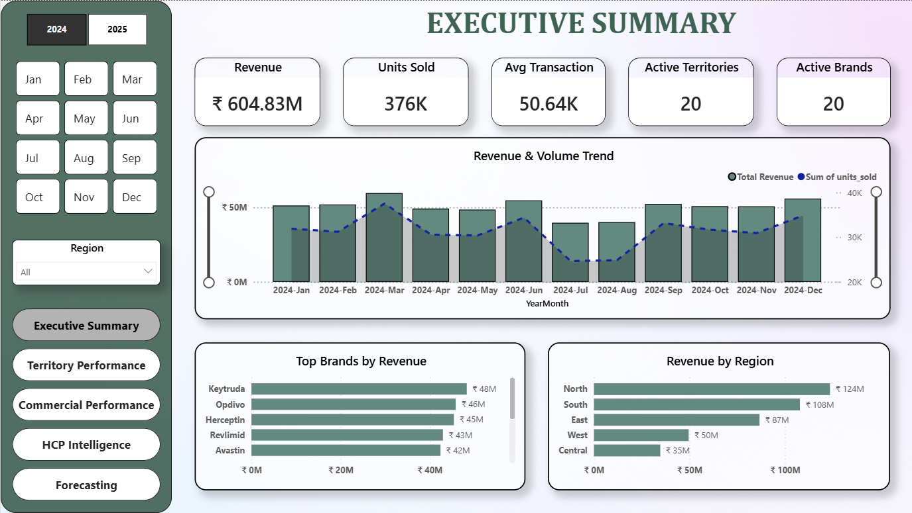
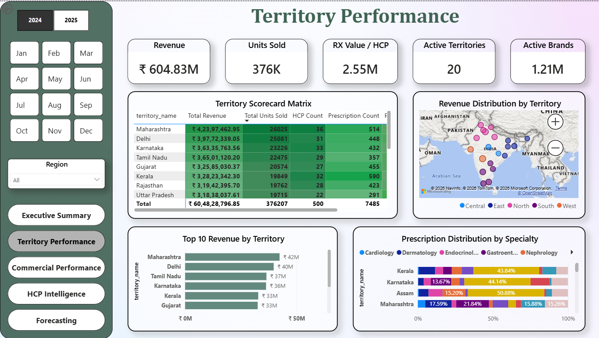
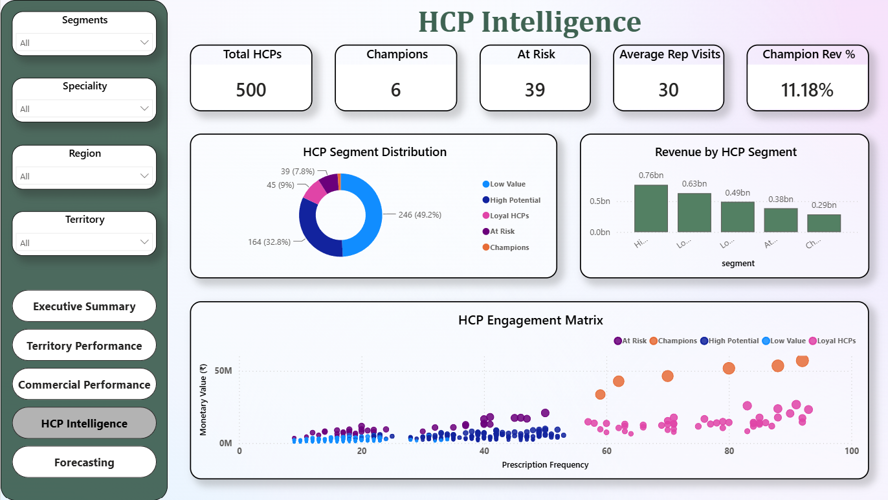
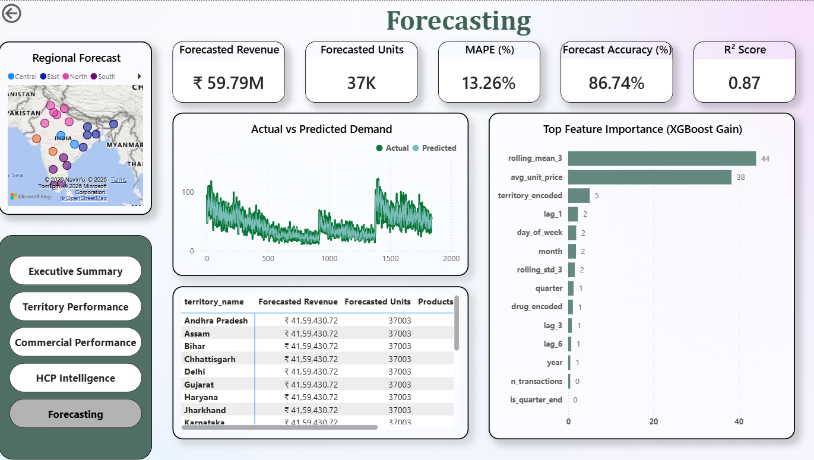

<div align="center">
  
  
  
  
  
  
</div>

<h1 align="center">MedForcast: Cloud-Native Pharmaceutical Analytics</h1>
<p align="center">
  <b>An end-to-end Data Engineering, Machine Learning, and Business Intelligence pipeline for the pharmaceutical industry.</b><br>
  Designed to optimize territory performance, segment healthcare professionals, and forecast drug demand.
</p>

---

## 📖 Project Overview
**MedForcast** is a comprehensive, cloud-hosted pharmaceutical data warehouse and analytics platform. It demonstrates a complete end-to-end data lifecycle: extracting raw commercial data, running a Python-based ETL pipeline, engineering advanced features, training predictive Machine Learning models, and serving the results through an Azure PostgreSQL database into an interactive Power BI dashboard.

## 🎯 Business Problem
Pharmaceutical companies struggle to allocate marketing resources efficiently. Commercial teams need to know:
1. **Which Healthcare Professionals (HCPs)** have the highest potential for prescription growth?
2. **Which territories** are underperforming despite high sales representative activity?
3. **What is the forecasted demand** for specific blockbuster drugs across different regions?

## 💡 Solution
This project solves these problems by:
- **Segmenting HCPs** using K-Means clustering (RFM analysis) to identify "Champions" and "At-Risk" providers.
- **Forecasting Demand** using XGBoost to predict future sales volumes with 86.7% accuracy.
- **Centralizing Data** in a cloud-native Azure PostgreSQL data warehouse.
- **Visualizing Insights** through a multi-page, executive-ready Power BI dashboard.

---

## ✨ Features
- **Automated ETL Pipeline:** Cleanses and transforms 6 raw datasets into a relational star schema.
- **Advanced Machine Learning:** Integrates K-Means clustering and XGBoost forecasting directly into the data model.
- **Cloud Infrastructure:** Hosted on Azure Database for PostgreSQL (Flexible Server).
- **Interactive Dashboards:** 4 pages of deep-dive analytics (Executive, Territory, Commercial, and Forecasting).

## 🛠 Tech Stack
| Category | Technology | Purpose |
|----------|------------|---------|
| **Language** | Python 3 | ETL, Data Processing, ML |
| **Data Processing** | Pandas, NumPy | Data cleaning, feature engineering |
| **Machine Learning** | Scikit-Learn, XGBoost | K-Means segmentation, Demand forecasting |
| **Database** | PostgreSQL | Relational data warehousing |
| **Cloud** | Microsoft Azure | Cloud database hosting (Flexible Server) |
| **Visualization** | Power BI | Interactive business intelligence dashboards |

---

## 🏗 Architecture



---

## ⚙️ ETL Pipeline
The pipeline is orchestrated via `run_pipeline.py` and performs the following:
1. **Ingestion:** Reads dirty pharmaceutical transaction logs, HCP master data, and territory mappings.
2. **Cleaning:** Handles missing values, standardizes date formats, and removes duplicate transactions.
3. **Feature Engineering:** Calculates RFM (Recency, Frequency, Monetary) scores for HCPs, rolling averages for sales, and lag features for time-series forecasting.
4. **Cloud Load:** Uses SQLAlchemy to automatically drop constraints, upload dimension/fact tables, and recreate the schema in Azure PostgreSQL.

<details>
<summary><b>Click to expand: View Data Dictionary</b></summary>

- `pharma_sales`: Fact table containing daily drug revenue and units sold.
- `prescriptions`: Fact table tracking individual Rx written by HCPs.
- `rep_activity`: Fact table logging sales rep visits and campaign outcomes.
- `hcp_master`: Dimension table for healthcare professionals.
- `territories`: Dimension table for geographic regions.
- `hcp_segments`: Output table from the ML pipeline.
</details>

---

## 🗄 Database Schema
The database follows a strict **Star Schema** optimized for Power BI.


*(The relational model connecting Dimension tables like `territories` and `hcp_master` to Fact tables like `pharma_sales` and `prescriptions`.)*

---

## 🤖 Machine Learning Pipeline

### 1. HCP Segmentation (K-Means)
- **Objective:** Group HCPs based on their prescribing behavior.
- **Features:** RFM (Recency, Frequency, Monetary Value).
- **Result:** 5 distinct clusters identified (Champions, Loyal HCPs, High Potential, At Risk, Low Value) with a Silhouette Score of 0.37.

### 2. Demand Forecasting (XGBoost)
- **Objective:** Predict monthly sales volume for specific drugs.
- **Features:** Lagged sales, rolling averages, seasonality indicators.
- **Result:** Achieved a **MAPE of 13.26%** and an **R² of 0.87**, yielding an overall forecast accuracy of 86.74%.

---

## ☁️ Azure Deployment
The entire data warehouse is hosted on **Azure Database for PostgreSQL - Flexible Server**.
- **Server:** `medforcast-server-lakshay.postgres.database.azure.com`
- **Security:** Encrypted via SSL (`sslmode=require`).
- **Automation:** Configured to automatically receive updated ML predictions via Python's SQLAlchemy integration.



---

## 📊 Dashboard Showcase

### Executive Summary
High-level KPIs, revenue trends, and top brand performance.


### Territory Performance
Geospatial analysis of revenue and prescription distribution across Indian territories.


### HCP Intelligence & Commercial ROI
Visualizing the K-Means clustering results and tracking Sales Rep campaign efficiency (111% ROI).


### Demand Forecasting
Actual vs. Predicted demand utilizing the XGBoost model outputs, highlighting feature importance.


---

## 📈 Business Insights
1. **Targeting Efficiency:** The "Champions" segment accounts for only 1.2% of total HCPs but drives 11.18% of total revenue. Marketing spend should be aggressively shifted here.
2. **Channel ROI:** Email campaigns showed the highest incremental revenue at the lowest cost, driving a total campaign ROI of 111%.
3. **Forecasting Reliability:** The XGBoost model successfully captures the quarterly seasonality of `Keytruda` and `Opdivo`, allowing supply chain teams to optimize inventory 3 months in advance.

---

## 🚀 Installation & Running the Project

### 1. Clone the repository
```bash
git clone https://github.com/yourusername/MedForcast.git
cd MedForcast
```

### 2. Install dependencies
```bash
python -m venv venv
source venv/bin/activate  # On Windows: venv\Scripts\activate
pip install -r requirements.txt
```

### 3. Configure Environment
Rename `.env.example` to `.env` and add your Azure PostgreSQL credentials:
```env
DB_HOST=your_server.postgres.database.azure.com
DB_NAME=medforcast
DB_USER=medadmin
DB_PASSWORD=your_password
```

### 4. Run the Pipeline
Upload the core tables, run the ML pipeline, and sync the results to Azure:
```bash
# 1. Upload dimension tables
python upload_core_tables.py

# 2. Run ETL, Feature Engineering, and Machine Learning
python run_pipeline.py

# 3. Upload processed facts and ML outputs to Azure
python upload_to_postgres.py
```

---

## 📉 Power BI Setup
1. Open the `dashboards/MedForcast.pbix` file.
2. Go to **Transform Data** > **Data Source Settings**.
3. Change the PostgreSQL server address to your Azure Endpoint.
4. Enter your database credentials.
5. Click **Refresh** to load the live data from Azure!

---

## 🔮 Future Improvements
- Implement Apache Airflow for automated daily orchestration of the ETL pipeline.
- Migrate the local XGBoost training to Azure Machine Learning (AML) workspaces.
- Add a Streamlit web app for real-time, interactive what-if forecasting scenarios.

---
**Author:** [Your Name/Lakshay]  
*Data Engineer & Analytics Professional* | [LinkedIn](https://linkedin.com/in/yourprofile) | [Portfolio](https://yourportfolio.com)
