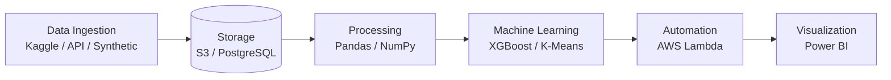

<div align="center">

# Pharma Sales Forecasting & HCP Intelligence Platform

*A commercial analytics platform for the pharmaceutical industry to forecast drug demand, segment providers, and measure commercial effectiveness.*


</div>

## Project Overview
A commercial analytics platform for the pharmaceutical industry that forecasts drug demand at the territory level, segments Healthcare Providers (HCPs) based on prescribing behavior, evaluates sales representative effectiveness, and measures promotional ROI.

## Project Highlights
* **500 HCPs** analysed
* **20 Territories**
* **50 Sales Representatives**
* **6 Interactive Power BI Dashboards**
* **XGBoost** Demand Forecasting
* **K-Means** HCP Segmentation
* **PostgreSQL** Data Warehouse
* **Feature Importance Analysis**

## Business Problem
Pharmaceutical companies struggle to accurately forecast territory-level drug demand, optimally segment healthcare providers (HCPs), and evaluate the ROI of promotions and sales rep effectiveness. This platform bridges the gap by leveraging machine learning and advanced data analytics to provide actionable commercial intelligence.

## Business Impact
This platform empowers pharmaceutical commercial teams to:
* **Optimize Supply Chain:** Accurately forecast territory drug demand to prevent stockouts and minimize excess inventory holding costs.
* **Target HCPs Effectively:** Focus marketing and sales efforts on high-value and loyal prescribers, while deploying retention strategies for at-risk accounts.
* **Boost Rep Productivity:** Identify best practices from top-performing sales representatives and provide targeted coaching to under-performers based on empirical activity data.
* **Maximize Marketing ROI:** Allocate promotional budgets toward the most effective channels and campaigns by rigorously measuring their financial returns.

## Key Features
* **Territory-Level Demand Forecasting:** Predict future drug demand using XGBoost, improving supply chain efficiency.
* **HCP Segmentation:** Cluster HCPs using K-Means into actionable segments (e.g., Champions, Loyal, At Risk).
* **Rep Effectiveness Analysis:** Calculate composite productivity scoring with prescription lift analysis.
* **Promotion ROI Measurement:** Track the effectiveness and financial return of various promotional campaigns.
* **Interactive Dashboards:** Comprehensive Power BI dashboards for exploring metrics across all commercial domains.

## Architecture



## Tech Stack

* **Programming:** Python, SQL
* **Database:** PostgreSQL
* **Machine Learning:** XGBoost, K-Means, SciPy
* **Analytics:** Pandas, NumPy
* **Visualization:** Power BI
* **Cloud:** AWS S3, AWS Lambda

## Machine Learning Pipeline
The project utilizes a multi-step ML pipeline:
1. **Data Cleaning:** Process raw ingestions into a standardized format.
2. **Feature Engineering:** Generate temporal, lag, rolling statistical, and RFM features.
3. **Model Training & Inference:** Train models and generate predictions.

### ML Models
1. **Demand Forecasting** — XGBoost Regressor for territory-level drug demand prediction, leveraging temporal features, lag features, and rolling statistics. Feature importance is also extracted automatically.
2. **HCP Segmentation** — K-Means clustering assigning providers to segments (Champions, Loyal, High Potential, At Risk, Low Value).
3. **Rep Effectiveness** — Composite productivity scoring incorporating prescription lift analysis.

## Model Performance
The XGBoost Demand Forecasting model achieves the following metrics on the test set:
* **MAE:** 5.22
* **MAPE:** 13.1%
* **R²:** 0.8767
* **Forecast Accuracy:** 86.9%

## Dashboard Overview
The Power BI application consists of 6 primary pages.

### 1. Executive Summary
* **Business objective:** Provide leadership with a high-level overview of overall commercial performance.
* **KPIs:** Total Revenue, Total Prescriptions, Forecast Accuracy, Overall ROI.
* **Main visuals:** Revenue trends, KPI scorecards, Year-over-Year growth charts.
* **Business value:** Enables quick, data-driven decisions at the executive level.
<!-- Executive Summary Screenshot -->

### 2. Territory Performance
* **Business objective:** Track and compare sales performance across geographical regions.
* **KPIs:** Territory Revenue, Market Share, Target Attainment.
* **Main visuals:** Map visuals of territory sales, bar charts comparing territories, performance gauges.
* **Business value:** Helps regional managers identify over-performing and under-performing areas for resource reallocation.
<!-- Territory Performance Screenshot -->

### 3. HCP Intelligence
* **Business objective:** Understand healthcare provider prescribing behavior to optimize engagement strategies.
* **KPIs:** HCP Segment Distribution, Average Prescriptions per HCP, Churn Risk.
* **Main visuals:** Segmentation scatter plots (RFM), segment breakdown pie charts, individual HCP profiles.
* **Business value:** Allows sales and marketing teams to tailor messaging based on provider segment and maximize engagement efficiency.
<!-- HCP Intelligence Screenshot -->

### 4. Rep Productivity
* **Business objective:** Evaluate the effectiveness of sales representatives.
* **KPIs:** Calls per Day, Prescription Lift, Cost per Call, Composite Productivity Score.
* **Main visuals:** Rep leaderboard, activity vs. results scatter plots, individual rep performance drill-downs.
* **Business value:** Identifies top performers for best-practice sharing and under-performers for targeted coaching.
<!-- Rep Productivity Screenshot -->

### 5. Promotion ROI
* **Business objective:** Measure the financial return of various marketing and promotional campaigns.
* **KPIs:** Campaign ROI, Incremental Revenue, Cost per Acquisition.
* **Main visuals:** ROI by channel bar charts, cost vs. revenue area charts, campaign performance tables.
* **Business value:** Optimizes the marketing budget by identifying the most profitable promotional channels.
<!-- Promotion ROI Screenshot -->

### 6. Demand Forecasting
* **Business objective:** Visualize future drug demand predictions to ensure adequate supply.
* **KPIs:** Predicted Units Sold, Forecasted Revenue, Forecast Error Rates.
* **Main visuals:** Actual vs. Forecast line charts, future demand projections by drug and territory.
* **Business value:** Prevents stockouts and reduces inventory holding costs through accurate demand planning.
<!-- Demand Forecasting Screenshot -->

## Project Structure

```
pharma-analytics/
├── config/               # Configuration files
├── dashboards/           # Power BI files & DAX measures
├── data/
│   ├── raw/              # Raw ingested data
│   ├── processed/        # Cleaned & feature-engineered
│   └── output/           # ML outputs & KPIs
├── docs/                 # Documentation
├── sql/                  # SQL scripts for data analysis
├── src/
│   ├── cloud/            # AWS utilities
│   ├── database/         # Schema & db loaders
│   ├── ingestion/        # Data loaders (Kaggle, FDA, Synthetic)
│   ├── models/           # ML models (demand_forecaster, hcp_segmenter, rep_analyzer)
│   ├── processing/       # Cleaning & feature engineering
│   └── utils/            # Helper functions
├── .env.example          # Environment variables template
├── regenerate_data.py    # Data generation script
├── requirements.txt      # Python dependencies
├── run_pipeline.py       # Full ML pipeline runner
├── upload_core_tables.py # Postgres core tables uploader
├── upload_to_postgres.py # Postgres general uploader
└── validate_data.py      # Data validation script
```

## Setup & Installation

```bash
# Create and activate virtual environment
python -m venv venv
venv\Scripts\activate

# Install dependencies
pip install -r requirements.txt

# Set up environment variables
copy .env.example .env
# Edit .env with your credentials

# Create database and apply schema
psql -U postgres -c "CREATE DATABASE pharma_analytics;"
psql -U postgres -d pharma_analytics -f src/database/schema.sql
```

## Running the Project

To execute the entire data processing and machine learning pipeline, run:

```bash
python run_pipeline.py
```

This script will automatically:
1. Clean raw data
2. Engineer features for models
3. Run the HCP K-Means segmentation
4. Run the XGBoost demand forecasting

*To populate the PostgreSQL database for the Power BI dashboards:*
```bash
python upload_core_tables.py
python upload_to_postgres.py
```

## Outputs
The pipeline outputs the following key files for Power BI ingestion into `data/output/`:
* `demand_forecasts.csv`
* `territory_forecasts.csv`
* `hcp_segments.csv`
* `feature_importance.csv`
* Model artifacts (`.pkl` files) and visualization charts (`.png`).

## Future Improvements
* Integrate real-time API streaming for daily sales data updates.
* Deploy the ML pipeline as serverless AWS Lambda functions triggered by S3 uploads.
* Implement a Deep Learning model (e.g., LSTM) for advanced time-series demand forecasting comparison.
* Add automated data quality checks integrated into a CI/CD pipeline.

## License
Distributed under the MIT License. See `LICENSE` for more information.
